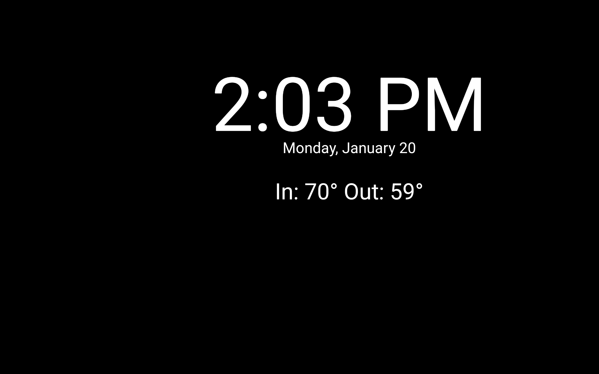
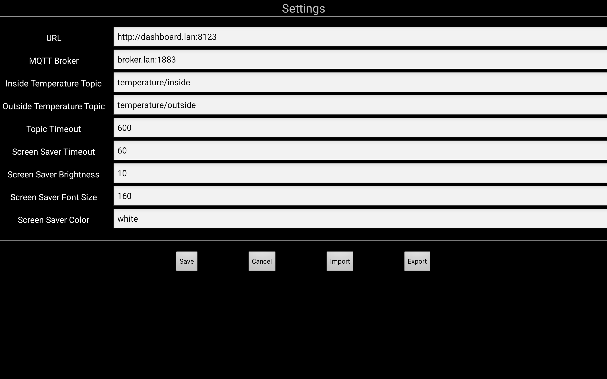

# Portal
An Android application that displays a web-based dashboard with a screen saver.

## Features

- Web based dashboards using Android's WebView component
- Customizable screen saver displaying the time and indoor/outdoor temperatures.
  The temperature values are supplied via [MQTT](https://mqtt.org/)
- Settings can be imported/exported

## Screenshots

| Screen Saver | Settings |
| ------------ | -------- |
|  |  |

When first run, the Settings screen will be displayed.  The available
settings are:

- **URL** 
The URL of the dashboard to be displayed
- **MQTT Broker** 
Hostname and port of the MQTT broker
- **Inside temperature topic** 
The MQTT topic supplying the inside temperature value
- **Outside temperature topic** 
The MQTT topic supplying the outside temperature value
- **Topic timeout** 
If a topic value has not been received from the MQTT broker after the specified
timeout (in seconds) the topic value will be set to -1
- **Screen saver timeout** 
The screen saver will be activated after the specified timeout (in seconds)
of inactivity
- **Screen saver brightness** 
When the screen saver is active, the screen brightness will be set to this
percentage
- **Screen saver font size** 
The font size of the time component of the screen saver.  The date and
temperature components are fixed sizes relative to this value
- **Screen saver color** 
Color of the screen saver text.  May be specified as a hex value (#RRGGBB) or
a color name.

The settings may be imported from or exported to a file.  To return to the
settings screen, tap the lower right corner of the dashboard.

## Building

Due to its abysmal performance, Gradle is not used for the build.

The application is built using the following tools/components:

- [GNU make](https://www.gnu.org/software/make/)
- [Podman](https://podman.io/)
- [Android Build Box](https://github.com/mingchen/docker-android-build-box)

### Preparing the build environment

- [Install Podman](https://podman.io/docs/installation)
- Download the Android Build Box image 
`podman pull docker.io/mingc/android-build-box`

### Building the application

- Build with `make` 
The build output is in `out/portal.apk`
- Optionally install with `make install` 
This will use `adb` to install the application

## License

_Licensed under the MIT License, Copyright (c) 2025 Greg Renda_
